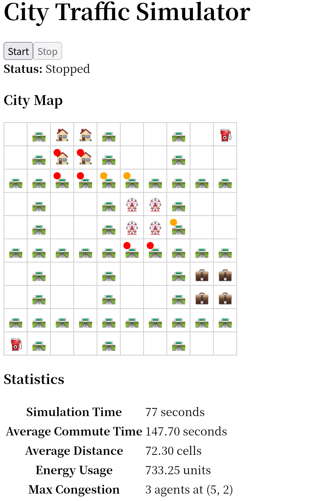
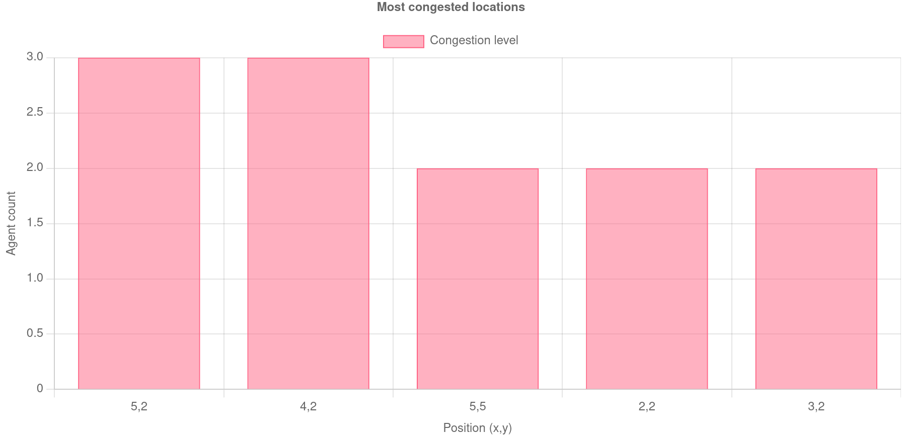

# City Traffic Simulator

A city traffic simulator in Rust and React+Chart.js

## Features

- A default 10x10 city grid with cell objects: `road`, `house`, `office`, `park`, `station`
- Simulated citizen behaviors: agents (citizen) move between houses and offices, regularly visiting parks
- Real-time visualization: view the city map with React+Websocket in real-time
- Statistics: show total energy used, commune travel time, average moved distance, congestion info in real-time

## Usage

```
make dev
```

## Structure

```
- frontend: React frontend project
- src: Rust backend
```

## Algorithms

- Pathfinder: BFS with depth limit (default: `1024`)
- Energy cost: (see `src/simulation/metrics.rs`)
    + `energy` = `base_energy` + `movement_energy` + `time_energy`
    + `base_energy`: energy consumed without doing anything
    + `movement_energy`: extra energy consumed when moving
    + `time_energy`: energy consumed when time is spent on commune

## Screenshot



